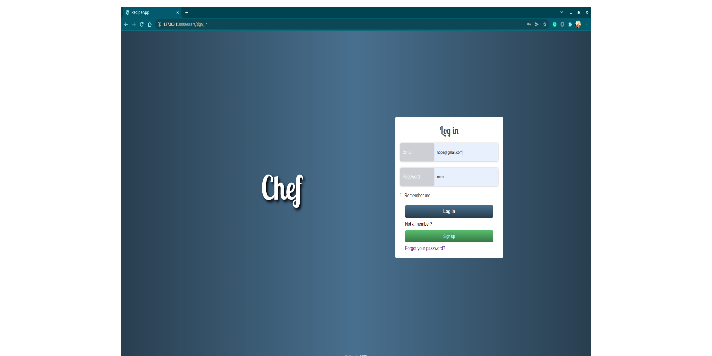
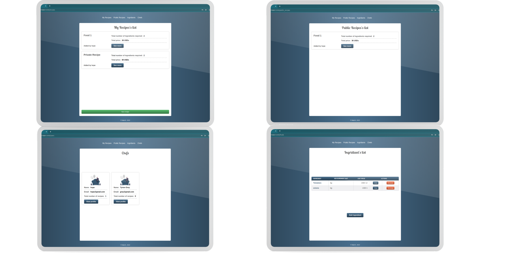

# ROR: Shef

> ROR app to create recipes and share them with the community.

## Built With

- Major languages: Ruby
- Frameworks: ROR

## Getting Started

To get a local copy up and running follow these simple example steps.

### Prerequisites

You need to have followings installed in your local machine:
- `Ruby`
- `Postgresql`
- `Rails`
- `RSpec`
- `node.js`

### Setup

To setup the Items Library project in your local, in the repo page: 
- click on code (dropdown list) > Download as ZIP. 
- or open terminal of path you want to install project and run this command:
`git clone git@github.com:zainsadaqat/recipe-app.git`
- `cd recipe-app/`
- `bundle install`
- `bin/rails db:create`
- `bin/rails db:migrate`

## Instruction on the usage
- Run the following comands in your command line:
- `rails s`
- `open any chrome/firefox`
- `type "localhost:3000"`
- `enjoy the app`

## Tests
- To run tests for current app, please run below commands in your terminal:
- `cd recipe-app/`
- `rspec spec spec/test_file_name`

## Author

👤 **Umidjon Ustabaev**

- GitHub: [@Hope1226](https://github.com/Hope1226)
- LinkedIn: [LinkedIn](https://www.linkedin.com/in/umidjon-ustabaev/)

👤 **Zain Sadaqat**

- GitHub: [@zainsadaqat ](https://github.com/zainsadaqat)
- Twitter: [@zain_sadaqat](https://twitter.com/zain_sadaqat)

## 🤝 Contributing

Contributions, issues, and feature requests are welcome!

Feel free to check the [issues page](https://github.com/zainsadaqat/recipe-app/issues).

## Show your support

Give a ⭐️ if you like this project!

## Acknowledgments

- Hat tip to anyone whose code was used
- Inspiration
- etc

## 📝 License

This project is [MIT](./MIT.md) licensed.
